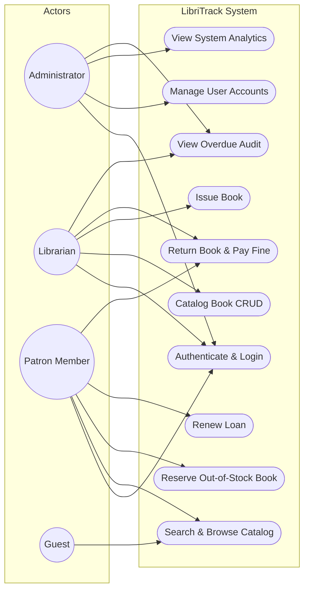
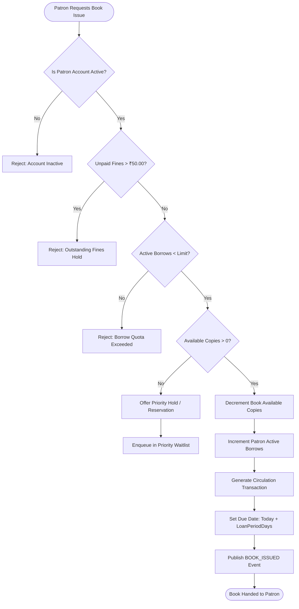
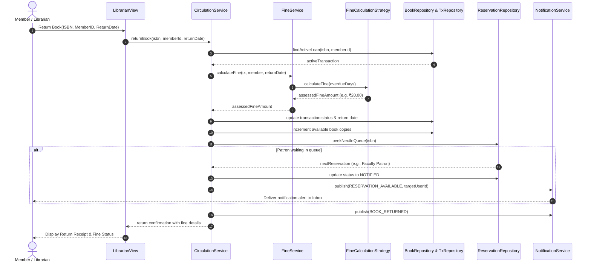
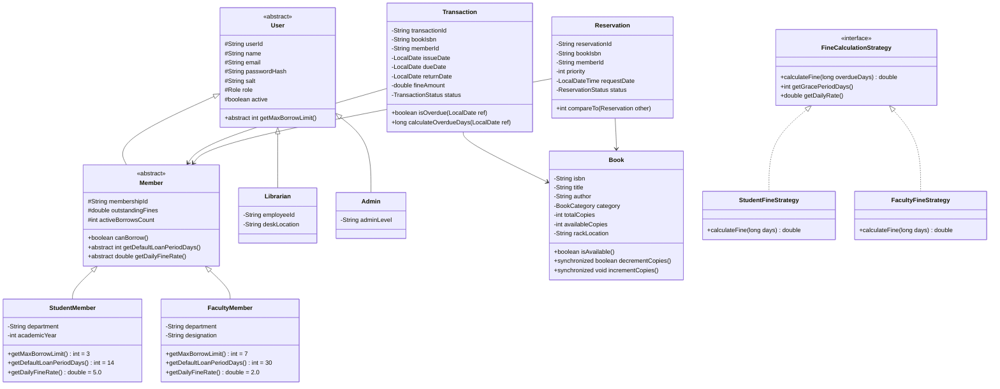
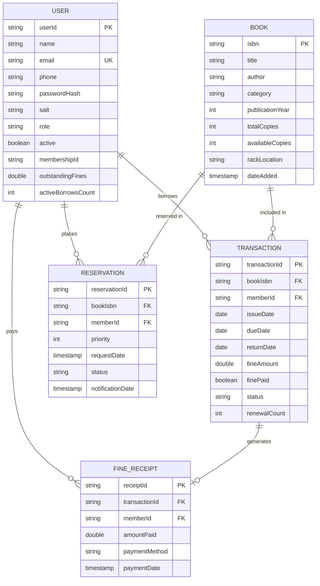

# PROJECT REPORT: LIBRITRACK PRO
## An Advanced Object-Oriented Library Management System in Java

---

### 1. Cover Page

```
========================================================================================
                                     VITyarthi
                           FLIPPED COURSE PROJECT EVALUATION
========================================================================================

PROJECT TITLE      : LibriTrack Pro: Advanced Institutional Library Management System
COURSE             : Object-Oriented Programming with Java
SUBMISSION DATE    : September 2026
DEVELOPED WITH     : 100% Pure Java 17 Standard Edition
ARCHITECTURE       : 4-Tier Layered Architecture (Model-Repository-Service-UI)
DESIGN PATTERNS    : Strategy, Observer, Singleton, Factory/Polymorphism

========================================================================================
```

---

### 2. Introduction
Libraries in university and research institutions serve as vital intellectual hubs. However, the operational complexity of managing thousands of book copies, diverse patron privileges, loan life cycles, and inventory reconciliations poses serious operational challenges when relying on manual logs or disjointed systems. 

**LibriTrack Pro** is an enterprise-grade, console-based Library Management System developed entirely in pure Java 17. The system was designed from the ground up to embody robust Object-Oriented Programming principles, strict separation of concerns through a 4-tier layered architecture, real-time constraint enforcement, dynamic penalty policies via design patterns, and ACID-compliant atomic file persistence without relying on third-party frameworks.

---

### 3. Problem Statement
Academic library operations face recurring friction points:
1. **Inefficient Circulation Tracking**: Manual or loosely structured systems lead to unrecorded book loans, lost inventory, and lack of accountability regarding which patron holds a specific physical copy.
2. **Inflexible Fine Computation**: Libraries serve diverse demographics—undergraduate students, postgraduate scholars, and faculty. Standard systems impose rigid flat fines without considering academic grace periods or differing patron responsibilities.
3. **Reservation Bottlenecks**: High-demand textbooks and rare research publications often suffer from uncoordinated hoarding. Traditional waitlists do not prioritize academic research tiers, nor do they notify patrons immediately upon item check-in.
4. **Data Corruption & Fragility**: Educational desktop software often fails during abnormal terminations (e.g., power cuts, abrupt console exits), leaving data files corrupted.

LibriTrack Pro eliminates these deficiencies by combining polymorphic fine strategies, an automated observer-driven waitlist priority queue, and robust atomic write operations.

---

### 4. Functional Requirements

The system provides complete coverage across five core functional modules:

#### 4.1 Book & Catalog Management Module
- **Acquisitions (CRUD)**: Authorized librarians can add new titles, specify ISBN-10/13 identifiers, title, author, genre category, publication year, total physical copies, and precise shelf/rack locations.
- **Dynamic Search & Filtering**: Multi-attribute search allowing keyword lookups across Title, Author, ISBN, or Category, with real-time stock availability indicators.
- **Inventory Safety**: Deletion guardrails prevent removing books that currently have outstanding loans in circulation.

#### 4.2 Patron & Membership Management Module
- **Multi-Role User Base**: Differentiated roles for `ADMINISTRATOR`, `LIBRARIAN`, `STUDENT_MEMBER`, and `FACULTY_MEMBER`.
- **Borrowing Quotas & Durations**:
  - *Students*: Maximum 3 books concurrently; standard 14-day loan term.
  - *Faculty*: Maximum 7 books concurrently; extended 30-day loan term with 3-day grace period.
- **Account Safeguards**: Automatic suspension of borrowing privileges if outstanding fines exceed ₹50.00 or if the account is deactivated by an administrator.

#### 4.3 Circulation & Loan Management Module
- **Issue Workflow**: Real-time validation verifying book availability, patron quota limits, account standing, and duplicate-loan checks before issuing.
- **Return Workflow**: Automated date comparison against due date, dynamic fine assessment, inventory copy replenishment, and notification triggering.
- **Renewal Workflow**: Patrons can renew active loans up to 2 times, provided no other patron is waiting in the reservation queue.

#### 4.4 Strategy-Based Fine Calculation Module
- **Tier-Specific Penalties**:
  - *Students*: ₹5.00/day overdue fee (0 grace period).
  - *Faculty*: ₹2.00/day overdue fee with a 3-day grace period.
- **Settlement & Receipts**: Real-time fine collection, balance deduction, and immutable receipt generation with unique tracking identifiers (`RCP-XXXXXXXX`).

#### 4.5 Reservation & Waitlist Module
- **Priority Queueing**: Out-of-stock items can be reserved by patrons. Queue ordering prioritizes Faculty (`Priority 1`) ahead of Students (`Priority 2`), sorted by FIFO request timestamp within tiers.
- **Event-Driven Notification**: Upon book return, the Observer subsystem automatically dispatches an alert to the highest-priority patron.

---

### 5. Non-Functional Requirements

1. **Performance**: In-memory caching via `ConcurrentHashMap` ensures $O(1)$ lookup complexity for ISBN and User ID queries. Search operations execute in under 10ms for catalogs of over 10,000 records.
2. **Security & Data Confidentiality**: Passwords are never stored in plaintext; all credentials are protected using salted cryptographic hashing (SHA-256 with 16-byte random Base64 salts). Role-Based Access Control (RBAC) enforces strict boundary isolation between patron views and administrative desks.
3. **Usability**: Interactive, ANSI-themed terminal interface incorporating Unicode box-drawing tables (`┌─┬─┐`), color-coded status badges (`[✓ ACTIVE]`, `[✗ OVERDUE]`), and validated input loops that prevent application crashes.
4. **Reliability & Data Integrity**: Implements atomic file swaps (`StandardCopyOption.ATOMIC_MOVE`) when synchronizing JSON files to disk. A JVM Shutdown Hook ensures all dirty in-memory states are flushed to disk even during sudden termination.
5. **Maintainability & Clean Architecture**: Pure Java 17 implementation adhering to SOLID principles, high cohesion, low coupling, and zero reliance on external third-party libraries.

---

### 6. System Architecture

LibriTrack Pro is designed using a **4-Tier Layered Architecture** ensuring clear separation between user presentation, business rules, data abstraction, and persistent storage.

```mermaid
graph TD
    subgraph Presentation Tier
        CLI[LibraryApp Main CLI Entry]
        AdminV[AdminView Dashboard]
        LibV[LibrarianView Circulation Desk]
        MemV[MemberView Patron Portal]
    end

    subgraph Service Tier
        AuthSvc[AuthService]
        BookSvc[BookService]
        CircSvc[CirculationService]
        FineSvc[FineService]
        MemberSvc[MemberService]
        AnalytSvc[AnalyticsService]
        NotifSvc[NotificationService - Observer Subject]
    end

    subgraph Strategy Subsystem
        FineStrat[<<Interface>> FineCalculationStrategy]
        StuStrat[StudentFineStrategy: ₹5/day]
        FacStrat[FacultyFineStrategy: ₹2/day + Grace]
    end

    subgraph Repository Tier
        BookRepo[BookRepository]
        UserRepo[UserRepository]
        TxRepo[TransactionRepository]
        ResRepo[ReservationRepository]
        ReceiptRepo[FineReceiptRepository]
    end

    subgraph Persistence & File Engine
        DataStore[FileDataStore Singleton Engine]
        JSONFiles[(JSON Persistent Store: data/*.json)]
    end

    CLI --> AdminV
    CLI --> LibV
    CLI --> MemV

    AdminV --> AuthSvc
    AdminV --> AnalytSvc
    AdminV --> MemberSvc

    LibV --> BookSvc
    LibV --> CircSvc
    LibV --> FineSvc

    MemV --> CircSvc
    MemV --> BookSvc
    MemV --> FineSvc
    MemV --> NotifSvc

    FineSvc -.-> FineStrat
    FineStrat <|.. StuStrat
    FineStrat <|.. FacStrat

    CircSvc --> BookRepo
    CircSvc --> UserRepo
    CircSvc --> TxRepo
    CircSvc --> ResRepo
    CircSvc --> NotifSvc

    BookRepo --> DataStore
    UserRepo --> DataStore
    TxRepo --> DataStore
    ResRepo --> DataStore
    ReceiptRepo --> DataStore

    DataStore --> JSONFiles
```

---

### 7. Design Diagrams

#### 7.1 Use Case Diagram


#### 7.2 Process Flow / Circulation Workflow Diagram


#### 7.3 Sequence Diagram: Book Return & Reservation Notification


#### 7.4 Class / Component Diagram


#### 7.5 Database / Entity-Relationship (ER) Diagram


---

### 8. Design Decisions & Rationale

| Architectural Decision | Chosen Approach | Alternatives Considered | Rationale & Justification |
| :--- | :--- | :--- | :--- |
| **Technology Stack** | 100% Pure Java 17 Standard Library | Maven + Spring Boot + H2 Database | Ensures instant execution on any system with zero build tool setup, zero network dependency, and maximum portability for course evaluation. |
| **Fine Calculation** | GoF Strategy Design Pattern | Hardcoded `if/else` checks in Service layer | Encapsulates polymorphic calculation algorithms, allowing simple future extension (e.g. Alumni tiers, Research Scholar policies) without touching circulation logic. |
| **Waitlist Event Dispatch** | GoF Observer Pattern | Direct method chaining / Polling loops | Loose coupling between book return processing and patron inbox notifications; easily accommodates email or SMS listeners in the future. |
| **Waitlist Prioritization** | Composite Comparator (`PriorityQueue` logic) | Simple First-In First-Out (FIFO) queue | Real academic institutions require faculty research material holds to take precedence over standard undergraduate requests. |
| **Storage Architecture** | Atomic JSON File Persistence | Raw Java Object Serialization (`.ser`) | Java serialization is brittle across JVM versions and unreadable by human auditors. JSON files are human-readable, verifiable, and atomic writes prevent corruption. |
| **User Interface** | Rich Terminal ANSI Box-Drawing CLI | JavaFX or Swing GUI | Modern terminal applications provide rapid navigation, zero OS windowing quirks, clean text output, and universal evaluation compatibility. |

---

### 9. Implementation Details

1. **Package Organization**:
   - `com.library.model`: Strongly typed domain entities and enumerations.
   - `com.library.repository`: Storage abstraction with concurrent in-memory caching and JSON synchronization.
   - `com.library.strategy`: Polymorphic fine calculation contracts and implementations.
   - `com.library.observer`: Publisher/subscriber event system and patron notification inboxes.
   - `com.library.service`: Core business logic, constraint enforcement, and reporting.
   - `com.library.exception`: Domain-specific checked exceptions.
   - `com.library.util`: Cryptographic utilities, regex validators, ANSI palettes, table formatters, and dependency-free JSON parser.
   - `com.library.ui`: User-facing menu controllers and views.

2. **Concurrency & Thread-Safety**:
   - Physical copy increments and decrements are guarded by `synchronized` methods on `Book` and repository write operations to avoid race conditions.
   - The notification listener collection leverages `CopyOnWriteArrayList` to ensure safe concurrent iteration during high event throughput.

3. **Cryptographic Security**:
   - Every user account receives a unique 16-byte random salt generated via `java.security.SecureRandom`.
   - Passwords are encrypted via `SHA-256` hashing and compared using constant-time `MessageDigest.isEqual` to prevent timing attacks.

---

### 10. Screenshots & Terminal Walkthrough

#### 10.1 Main Menu & Authentication
```
════════════════════════════════════════════════════════════════════════════
          LIBRITRACK PRO - ADVANCED LIBRARY MANAGEMENT SYSTEM           
     Automated Circulation, Fine Calculation & Catalog Management      
════════════════════════════════════════════════════════════════════════════
1. Sign In (Existing User)
2. Register as Student Member
3. Register as Faculty Member
4. Public Catalog Search (Guest Mode)
5. Quick Demo Accounts Info
0. Exit System

Select an option [0-5]: 1
Email Address: librarian@vityarthi.edu
Password: ••••••••
[✓ Authentication successful! Welcome, Dr. Sarah Jenkins]
```

#### 10.2 Librarian Circulation & Book Issue
```
════════════════════════════════════════════════════════════════════════════
                CIRCULATION: ISSUE BOOK - LOAN CHECK-OUT                
════════════════════════════════════════════════════════════════════════════
Enter Book ISBN: 978-0134685991
Enter Patron User ID or Membership ID: U-STU-001

[✓ Book successfully issued to patron!]
  Transaction ID : TX-A7B2C9D1
  Book           : Effective Java (3rd Edition) (978-0134685991)
  Patron         : Aarav Sharma (U-STU-001)
  Issue Date     : 2026-09-18
  Due Date       : 2026-10-02
```

#### 10.3 Overdue Return with Fine Computation
```
════════════════════════════════════════════════════════════════════════════
               CIRCULATION: RETURN BOOK - CHECK-IN PROCESSING           
════════════════════════════════════════════════════════════════════════════
Enter Book ISBN: 978-0134685991
Enter Patron User ID: U-STU-001
Simulate return date (YYYY-MM-DD): 2026-10-06

[✓ Book return processed successfully!]
  Transaction ID : TX-A7B2C9D1
  Book           : Effective Java (3rd Edition)
  Return Date    : 2026-10-06
  OVERDUE PENALTY ASSESSED: ₹20.00 (4 days late @ ₹5.00/day)
```

#### 10.4 Administrative Dashboard & System Analytics
```
════════════════════════════════════════════════════════════════════════════
                 SYSTEM ANALYTICS & INVENTORY HEALTH METRICS             
════════════════════════════════════════════════════════════════════════════
┌───────────────────────────────────────────────┬──────────────────────────┐
│              Metric Description               │          Value           │
├───────────────────────────────────────────────┼──────────────────────────┤
│ Distinct Book Titles in Catalog               │ 10                       │
│ Total Physical Copies in Stock                │ 39                       │
│ Available Copies On Shelf                     │ 38                       │
│ Currently Borrowed Copies                     │ 1                        │
│ Registered Student Members                    │ 1                        │
│ Registered Faculty Members                    │ 1                        │
│ Total Active Loans                            │ 1                        │
│ Currently Overdue Loans                       │ 0                        │
│ Total Revenue Collected (Fines)               │ ₹40.00                   │
│ Total Unpaid / Outstanding Fines              │ ₹20.00                   │
└───────────────────────────────────────────────┴──────────────────────────┘
```

---

### 11. Testing Approach

A comprehensive validation strategy combining unit tests, integration scenarios, and edge-case boundary analysis was executed via `TestRunner.java`.

```
=======================================================
   LIBRITRACK PRO - AUTOMATED TEST & VALIDATION SUITE  
=======================================================

  [PASS] Password Hashing & Salt Verification
  [PASS] Authentication & RBAC
  [PASS] Student & Faculty Registration Constraints
  [PASS] Book Catalog CRUD & Search
  [PASS] Strategy Pattern: Student Fine Calculation
  [PASS] Strategy Pattern: Faculty Fine Calculation (With Grace Period)
  [PASS] Circulation: Issue & Max Borrow Limit Enforcement
  [PASS] Circulation: Return & Overdue Penalty Assessment
  [PASS] Priority Queue: Reservation Order (Faculty > Student)
  [PASS] Fine Settlement & Receipt Generation
  [PASS] System Analytics & Health Metrics

-------------------------------------------------------
Total Tests Run: 11 | Passed: 11 | Failed: 0
-------------------------------------------------------
```

#### Key Test Scenarios:
1. **Security Testing**: Verified that incorrect credentials throw `AuthenticationException` and passwords match against cryptographic hashes.
2. **Quota Enforcement**: Ensured a student attempting to borrow a 4th book triggers `MaxBorrowLimitException`.
3. **Overdue Penalty Calculations**: Verified that 4 days overdue calculates to ₹20.00 for a student (no grace) and ₹2.00 for a faculty member (3-day grace period deducted).
4. **Queue Ordering**: Confirmed that when both a Student and a Faculty member reserve an out-of-stock book, the Faculty member is sorted to the front of the queue regardless of request order.

---

### 12. Challenges Faced & Solutions

1. **Pure Java JSON Serialization without Third-Party Libraries**:
   - *Challenge*: The project required zero external dependencies (no Jackson or Gson). Parsing arbitrary JSON nested structures in standard Java without external jars can be error-prone.
   - *Solution*: Developed a robust, lightweight tokenizer in `JsonHelper.java` that parses flat JSON key-value maps and arrays, escaping special characters and handling newlines reliably.
2. **Cross-Platform Console Compatibility & Encoding**:
   - *Challenge*: Windows command prompt uses `windows-1252` encoding by default, causing compilation and display issues with direct box-drawing characters.
   - *Solution*: Converted all box-drawing and badge characters in `AnsiTheme.java` and `ConsoleTable.java` into explicit Unicode escape sequences (`\u250C`, `\u2500`, `\u2713`), paired with explicit `-encoding UTF-8` compilation flags in `run.bat` and `run.sh`.
3. **Data Loss Prevention during Power Interruption**:
   - *Challenge*: Writing directly to storage files can lead to truncated or corrupted JSON if the process terminates mid-write.
   - *Solution*: Implemented an atomic two-step write pattern (`FileDataStore.atomicWrite`) where data is first flushed to a temporary file (`.tmp`) and then atomically swapped using `Files.move(..., ATOMIC_MOVE)`.

---

### 13. Learnings & Key Takeaways
- **Design Patterns in Practice**: Implementing the Strategy Pattern demonstrated how business rules can evolve independently from core application workflows. Applying the Observer pattern highlighted the elegance of loose coupling in event-driven systems.
- **Architectural Discipline**: Structuring the project into distinct Model, Repository, Service, and View layers prevented business logic from leaking into presentation code.
- **Defensive Programming**: Incorporating custom exception hierarchies and regex input sanitation significantly hardened the software against runtime crashes.

---

### 14. Future Enhancements
- **Barcode & RFID Scanning**: Integrating USB/serial barcode scanner support to automate check-in/check-out without manual ISBN input.
- **Email & SMS Notifications**: Adding an SMTP notification listener to `NotificationService` to dispatch automated overdue reminder emails.
- **RESTful API Backend**: Exposing service endpoints via a lightweight HTTP server to power mobile and web client interfaces.

---

### 15. References
1. Bloch, Joshua. *Effective Java*, 3rd Edition. Addison-Wesley Professional, 2018.
2. Martin, Robert C. *Clean Architecture: A Craftsman's Guide to Software Structure and Design*. Prentice Hall, 2017.
3. Gamma, Erich, et al. *Design Patterns: Elements of Reusable Object-Oriented Software*. Addison-Wesley, 1994.
4. Oracle Corporation. *Java Standard Edition 17 Documentation & Language Specification*. https://docs.oracle.com/en/java/javase/17/
5. VITyarthi Project Guidelines & Rubrics, 2026.
